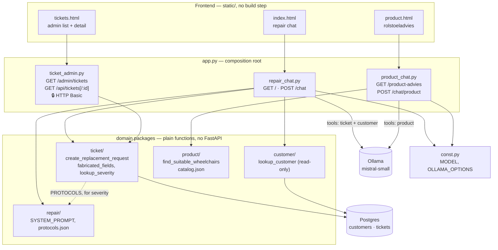
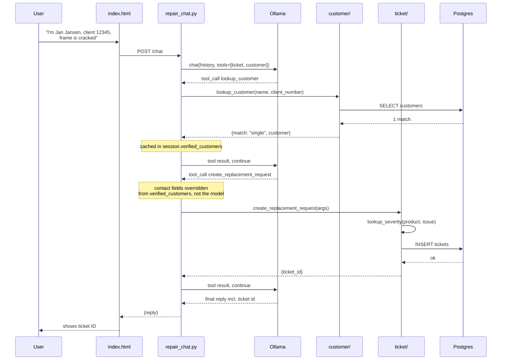

# care_chat

Local chatbot for care-product repair support (wheelchairs, support beds). Users describe damage; the bot matches it against a repair-protocol catalog, walks them through DIY fixes for minor issues, and for major damage arranges a temporary replacement + logs a pickup/repair ticket to Postgres. It can also recognize a returning customer (by name or client number, looked up against Postgres) and reuse their contact details instead of re-asking. A second, separate chat mode helps people who don't have a wheelchair yet pick a suitable one from a small catalog, based on weight and usage needs. Runs local: FastAPI + Ollama for the model, Postgres for customers and tickets, no cloud LLM.

## Architecture

- `app.py` — thin composition root: creates the FastAPI app, loads `.env`, includes the three routers below. No route bodies, session state, or dispatch logic of its own.
- `chat_types.py` — shared `ChatIn` pydantic model (`{message: str}`), used by both chat routers. (Named `chat_types.py`, not `types.py` — a project-root `types.py` shadows the stdlib `types` module, which FastAPI/Starlette/pydantic use internally; caused confusing breakage the one time this got named that.)
- `repair_chat.py` — `APIRouter`: `GET /` (serves `static/index.html`) + `POST /chat` (repair dispatch loop — `create_replacement_request`/`lookup_customer` handling, the `verified_customers` override, the `fabricated_fields` guard). Owns its own `sessions` store.
- `product_chat.py` — `APIRouter`: `GET /product-advies` (serves `static/product.html`) + `POST /chat/product` (product dispatch loop — `find_suitable_wheelchairs` handling only). Owns its own `product_sessions` store.
- `ticket_admin.py` — `APIRouter`: `GET /admin/tickets`, `GET /api/tickets`, `GET /api/tickets/{id}`, plus `require_admin` and the `ADMIN_USER`/`ADMIN_PASSWORD` env vars. The only auth-gated surface in the app (see below).
- `db.py` — shared `DATABASE_URL` (env-overridable via `.env`, raises at import time if unset). Used by both `ticket/` and `customer/` — lives at project root since it's cross-domain infra, not owned by either package.
- `const.py` — shared `MODEL`, `OLLAMA_OPTIONS`. Lives at project root, same reasoning as `db.py`: both `repair_chat.py` and `product_chat.py` import it directly and independently, so it's app-wide config, not owned by either chat's domain package.
- `repair/` — `prompts.py` (loads `repair/protocols.json`, builds SYSTEM_PROMPT — also imports `CATALOG` from `product` and embeds it as background-only reference so the repair bot can recognize a named model and its specs; repair steps still only ever come from `protocols.json`), `protocols.json` (catalog: `product -> issue -> {severity: minor|major, steps: [...]}`, lowercase keys — extend here to support new products, no code change needed), `__init__.py` re-exports `SYSTEM_PROMPT`. Named `repair/`, not `prompt/` — it's specifically the repair chat's domain package (system prompt, protocol catalog); `product/` has its own `prompts.py` for the product-advice chat, so a generic "prompt" name stopped reflecting which domain it belonged to.
- `ticket/` — `tickets.py` (TOOL_SCHEMA, TICKET_FIELDS, lookup_severity, fabricated_fields, insert_ticket, list_tickets, get_ticket, generate_ticket_id, create_replacement_request — both the Python function and the tool-call name the model sees are `create_replacement_request`; imports PROTOCOLS from `repair.prompts`, DATABASE_URL from `db`), `schema.sql` (`tickets` table, auto-run by the `db` docker-compose service on first start), `__init__.py` re-exports `TOOL_SCHEMA`, `fabricated_fields`, `create_replacement_request`, `list_tickets`, `get_ticket`.
- `customer/` — `customers.py` (TOOL_SCHEMA for `lookup_customer`, `find_customer` raw query, `lookup_customer` dispatch wrapper), `schema.sql`/`seed.sql` (auto-run by the `db` docker-compose service on first start), `__init__.py` re-exports `TOOL_SCHEMA`, `lookup_customer`. **Lookup-only** — the bot never writes to this table, only the operator does (via `psql`/SQL insert).
- `product/` — genuinely separate chat mode, not a tool bolted onto the repair prompt (see below). `catalog.json` (fictional wheelchairs + support beds, each tagged `"category": "wheelchair" | "bed"` — invented names, no real manufacturer/URL; spec *shapes* are grounded in realistic data, but no real vendor's actual lineup), `products.py` (TOOL_SCHEMA for `find_suitable_wheelchairs`, the matching function itself — filters candidates to `category == "wheelchair"` first, so bed entries never surface as a wheelchair recommendation), `prompts.py` (PRODUCT_SYSTEM_PROMPT, imports CATALOG from `.products` and filters to wheelchairs only before embedding it — the product-advice chat is still wheelchair-only), `__init__.py` re-exports `TOOL_SCHEMA`, `find_suitable_wheelchairs`, `PRODUCT_SYSTEM_PROMPT`, `CATALOG` (the last one specifically so `repair/prompts.py` can reuse the raw catalog — see below).
- `static/index.html` — repair chat UI, plain HTML/CSS/JS, no build step.
- `static/product.html` — wheelchair-recommendation chat UI, same no-build-step approach, own `localStorage` session key so it doesn't collide with the repair chat's session.
- `static/tickets.html` — read-only ticket admin page (list + detail), same no-build-step approach, served at `/admin/tickets`. The **only** part of the app behind auth — see below.
- `docker-compose.yml` — local Postgres for both `customers` and `tickets` tables; schemas + example customer rows auto-loaded on first `docker compose up`.
- `test_chat.py` — smoke tests with mocked `ollama.chat`, mocked `customer.customers.find_customer`, mocked `ticket.tickets.insert_ticket`; no model, no Ollama, no Postgres needed to run.

Model: `mistral-small` (constant `MODEL` in `const.py`, ~14GB). Switched from `qwen2.5:14b-instruct` — same/better Dutch fluency, and noticeably more reliable structured tool-calling: qwen2.5:14b occasionally skipped `lookup_customer` while claiming it had looked someone up, or leaked a hand-written pseudo tool-call as visible text instead of a real tool call; 5/5 trials on mistral-small produced a clean structured call. One-line swap in `const.py` to try something else later.

### Diagram



Request flow for a repair ticket filed against a known customer — the part worth tracing is what gets verified server-side rather than trusted from the model (see `verified_customers` in Key design decisions below):



## Key design decisions (don't undo casually)

- **Catalog stuffed into system prompt, no RAG.** Catalog is small; keep it that way until it isn't.
- **`num_ctx: 8192` in every `ollama.chat` call.** Ollama defaults to 4096 and silently truncates from the top — the model forgets the catalog. Don't remove.
- **Severity resolved server-side** (`lookup_severity`, in `ticket/tickets.py`) from protocols.json at tool execution. Never trust severity from the model.
- **Fabrication guard** (`fabricated_fields`, in `ticket/tickets.py`): tool call rejected unless contact_name/contact_info/address appear literally (casefolded substring) in the user's own messages this session. Smaller models otherwise invent "John Doe" contact details and files fake tickets. False reject just makes the bot re-ask — that direction is fine.
- **Sessions in-memory**, keyed by `X-Session-Id` header (browser localStorage UUID). `{"history": [...], "verified_customers": {}}`. Lost on restart; only tickets (in Postgres) are durable. Swap for postgres-backed sessions only if continuity is actually needed.
- **Tickets in Postgres, not a file.** `ticket/tickets.py`'s `insert_ticket` does a plain `psycopg` insert, fresh connection per call, same reasoning as `find_customer` (no pool at this scale). No FK from `tickets.client_number` to `customers.client_number` — tickets can be filed for people not in the customer table, so a strict FK would reject those inserts.
- **Ticket IDs are short human-friendly codes, not UUIDs.** `generate_ticket_id()` picks 8 random chars from a 31-symbol alphabet (digits 2-9 + uppercase minus I/L/O — no characters that get misread aloud or by hand). `ticket_id` is `TEXT`, not `UUID`, in `ticket/schema.sql`. No collision retry — at this app's scale (~8.5e11 possible codes) it's not worth the complexity; add one if that stops being true.
- **Customer records never trusted from the model.** A `lookup_customer` tool call that returns exactly one match gets cached into the session's `verified_customers` dict. Only when `create_replacement_request` is called with a `client_number` that's actually in that dict does the server override `contact_name`/`contact_info`/`address` with the DB record — the model's own values for those fields are discarded. Without a verified match, the existing `fabricated_fields` guard still applies. This closes the obvious bypass: claiming a `client_number` plus plausible-looking contact fields doesn't work unless a real lookup happened first.
- **The model sometimes narrates a tool action without calling the tool** — confirmed reproducible on `mistral-small` across all three tools: claiming a ticket was filed/passed to service without calling `create_replacement_request`; claiming a customer lookup succeeded (even inventing a plausible-looking fake address) without calling `lookup_customer`; claiming to have "found options" or being about to "go check" without calling `find_suitable_wheelchairs`. Both `repair/prompts.py` and `product/prompts.py` have an explicit "CRITICAL" rule against this — narrating an action (future OR past tense) or stating any looked-up/found detail without the matching tool call in the same turn. Simply saying "the tool call does nothing by itself" wasn't enough on its own; the rule also has to explicitly say "call it immediately instead of describing what you're about to do" — softer phrasing left the narrating-intent case (e.g. "I'll go check the catalog now") unfixed even after the claiming-completion case was fixed. The server-side guards (`fabricated_fields`, the `verified_customers` override) still block a ticket from being written with hallucinated data either way, but the false claim shown to the user is a real UX bug on its own, not just a data-integrity one. If the prompt rule proves insufficient again, the next lever is a server-side check: no `tool_calls` present but the reply reads like an action was taken → re-prompt before returning to the user. Not built yet.
- **`product/` is a genuinely separate chat mode, not a tool on the repair bot.** Own system prompt (`PRODUCT_SYSTEM_PROMPT`), own router (`product_chat.py`), own session store (`product_sessions`, plain `dict[str, list]` — no `verified_customers`-style state needed since this flow has nothing to "unlock"). Was originally built as one more tool on the existing `/chat` endpoint; deliberately split out because mixing a "shop for a new product" intent into a "fix my broken product" persona muddies both. The two modes share nothing at runtime — a message sent to `/chat` cannot trigger `find_suitable_wheelchairs` and a message to `/chat/product` cannot trigger `create_replacement_request`/`lookup_customer`, because each router only ever passes its own tool list to `ollama.chat`. Same split at the file level: `repair_chat.py` and `product_chat.py` don't import from each other — the only thing they share is `ChatIn` from `chat_types.py`, since that shape is truly generic (not tied to either domain). **`repair/prompts.py` importing `CATALOG` from `product/` is not an exception to this** — it's a one-way, import-time-only reuse of static reference data (product specs baked into the repair system prompt string), not a shared tool or shared dispatch path. The repair bot still can't call `find_suitable_wheelchairs`, and the product bot still can't call `create_replacement_request`/`lookup_customer`; the two chats still can't trigger each other's tools mid-conversation.
- **`/admin/tickets`, `/api/tickets`, `/api/tickets/{id}` are the only auth-gated routes** in the app — plain HTTP Basic (`require_admin` dependency in `ticket_admin.py`), credentials from `ADMIN_USER`/`ADMIN_PASSWORD` in `.env`, no default password (fails with a clear 500 if unset, rather than running with something guessable). Chosen because this page aggregates every customer's PII in one place, unlike the chat page which only ever shows one person their own data. The rest of the app deliberately stays unauthenticated (see Rules).
- **Every package `__init__.py` uses explicit `__all__`** to re-export its public names, rather than relying on bare `from .module import X` (which `ruff`/most linters flag `F401` unused-import on, since nothing in that same file *uses* X — the import's only purpose is to re-export it for other modules).
- **`static/tickets.html` escapes all user-influenced fields** (`product`, `issue`, `contact_name`, `contact_info`, `address`, `notes`) before inserting into `innerHTML` — those values ultimately come from chat input relayed through the model, so treat them as untrusted on this page. `severity` is not escaped since it's server-resolved from a fixed vocabulary (`minor`/`major`/`unknown`), never free text.

## Commands

```bash
cp .env.example .env                # Postgres credentials + DATABASE_URL, gitignored
docker compose up -d                # local Postgres for customer lookups, schema+seed auto-loaded
ollama pull mistral-small   # once, ~14GB
.venv/bin/pip install -r requirements.txt
.venv/bin/pytest test_chat.py     # fast, no model/Postgres needed
.venv/bin/ruff check .             # lint; add --fix for the auto-fixable ones
.venv/bin/uvicorn app:app --reload  # http://localhost:8000
```

Credentials live only in `.env` (gitignored) — `docker-compose.yml` reads `POSTGRES_DB`/`POSTGRES_USER`/`POSTGRES_PASSWORD` from it automatically, and `db.py` loads `DATABASE_URL` from it via `python-dotenv`. No credentials are hardcoded in source; `db.py` raises at import time if `DATABASE_URL` isn't set.

If you're on an existing `db` container created before the `tickets` table existed, docker-compose's `initdb.d` scripts only run once on volume creation — apply the new schema manually: `docker compose exec -T db psql -U care_chat -d care_chat -f - < ticket/schema.sql`.

## Rules

- Never put real user PII (emails, names, addresses) in tests or test payloads — synthetic data only (`example.com`, fake names).
- System prompt says: never invent repair steps for uncatalogued products — this is safety-relevant (care equipment). Keep that instruction when editing the prompt.
- Keep it small: no framework on the frontend, no ORM/connection pool/migrations framework unless requirements change. No auth anywhere except `/admin/tickets` and its API — that's a deliberate exception, not the start of a pattern; don't add auth elsewhere without the same kind of justification (aggregated PII, not just "would be nice").
- The `customers` table is lookup-only from the app's side — never add a write/insert path from the chat flow. New customers go in via SQL directly.
- Any HTML rendered from ticket/customer data must be escaped (see `static/tickets.html`'s `esc()`) — that data traces back to chat input.
